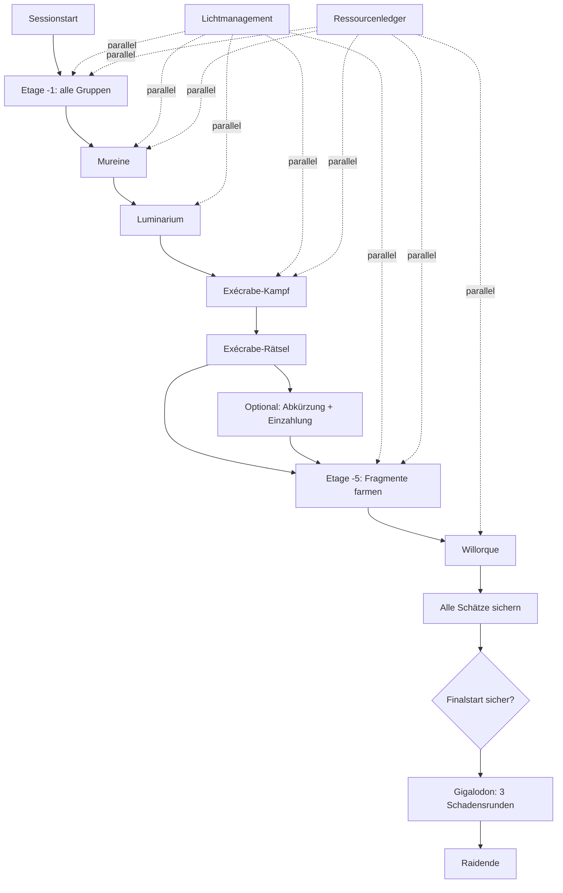

# Gigalodon Task Graph

**Dokumentstatus:** Implementierungsgrundlage v0.2.1 / Projekt v0.8.6.1  
**Raid:** Gouffre du Gigalodon  
**Spielstand:** Update 3.6 / geprüft am 26.06.2026  
**Kerncharakter:** zeitkritische Expedition mit parallelem Licht-, Inventar-, Zugang- und Scoremanagement.

## 1. Quellen

- https://www.dofuspourlesnoobs.com/gouffre-du-gigalodon.html
- https://www.dofuspourlesnoobs.com/solveur-du-luminarium.html
- https://www.dofus.com/fr/mmorpg/actualites/maj/1770516-raid-not-dead/details
- Patch 3.6.4.3:
  https://www.dofus.com/fr/mmorpg/actualites/maj/1770516-raid-not-dead/correctifs/1770644-patch-notes-3-6-4-3-24-06-2026

## 2. Globale Sessionvariablen

```yaml
raid:
  minParticipants: 8
  maxParticipants: 12
  durationSeconds: 3600
  rewardTrackMaxScore: 60000
  leaderboardScoreMax: null
  currentConfirmedScore: 0
  projectedUnbankedScore: 0
  status: LOBBY | LIVE | FINAL_PREP | FINAL_ACTIVE | ENDED

lights:
  floor1: { level: 4, baselineLevel: 4, sourceStatus: GUIDE_CONFIRMED, nextDecayAt: sessionStartedAt + 120s }
  floor2: { level: null, nextDecayAt: null }
  floor3: { level: null, nextDecayAt: null }
  floor4: { level: null, nextDecayAt: null }
  floor5: { level: null, nextDecayAt: null }

fragments:
  first: false
  second: false
  third: false
  fourth: false

access:
  floor2: false
  floor3: false
  floor4: false
  floor5: false
  floor6: false

saltPool:
  amount: 0
  changes: []
```

### Globale Regeln

- Score aus Ressourcen zählt erst nach Einzahlung in den Raidkoffer.
- Bei verlorenen Kämpfen verliert der Spieler laut Guide alle getragenen Raidressourcen und wird nach oben teleportiert.
- Handel zwischen Spielern ist deaktiviert.
- Unique Bossressourcen landen bei genau einem Charakter im Kampf.
- Zwischenbosse sind einmalig und respawnen nicht.
- Der Gigalodon-Kampf muss vor Ablauf der Stunde gestartet werden.
- Nach Start darf der Finalkampf über die Stundenmarke hinauslaufen.
- Der Raid endet durch Captain-Abbruch, Zeitablauf vor Finalstart oder Start/Abschluss des Gigalodon-Finales gemäss In-Game-Verhalten.

## 3. Scorewerte

| Ressource | Punkte |
|---|---:|
| Sel des profondeurs, gemeinsamer Raidpool | 0 |
| Quartz | 2 |
| Opale | 4 |
| Amazonite | 6 |
| Aventurine | 10 |
| Lapiz | 15 |
| Jais | 20 |
| Onyx | 30 |
| Unité de Mureine | 1'000 |
| Rancune d'Exécrabe | 5'000 |
| Noirceur de Willorque | 10'000 |

## 4. Gesamtgraph



---

# 5. Dauerprozesse

## G-LIGHT – Lichtmanagement

### Regeln

- Lichtstufen: 4, 3, 2, 1, 0.
- Jede Stufe hält laut Guide zwei Minuten.
- Von 4 bis 0 vergehen deshalb acht Minuten.
- Zwei Luminomachines pro betroffener Etage; beide zeigen denselben Etagenzustand.
- inkrementelle Kosten der nächsten Erhöhung:

| Lichtlevel | Salzangabe |
|---|---:|
| 1 | 1 |
| 2 | 3 |
| 3 | 6 |
| 4 | 10 |

**Implementierung:** Diese Guide-Baseline wird versioniert als `incrementalSaltCostByLevel`. Eine mehrstufige Auffüllung summiert alle Schritte. Status `GUIDE_CONFIRMED`, noch nicht durch RAIDWEAVE live bestätigt.

### G-LIGHT-010 – Etagenlicht initialisieren

Initialisierung:

- Etage −1 startet mit Lichtstufe 4 beim Sessionstart;
- jede neu freigeschaltete tiefere Etage startet mit Lichtstufe 1;
- `observedAt` und erwarteter Verfall beginnen mit der serverseitigen Freischaltung;
- spätere Ablesungen sind Beobachtungen, keine stillen Erhöhungen.

Resultat:

```yaml
lightState:
  floor: -1
  level: 4
  observedAt: timestamp
  nextDecayAt: observedAt + 120s
  sourceStatus: GUIDE_CONFIRMED
```

### G-LIGHT-020 – Warnungen

| Zustand | Warnung |
|---|---|
| Level 4 | keine |
| Level 3 | Hinweis |
| Level 2 | gelb |
| Level 1 | orange; Aggressionsrisiko in Kürze |
| Level 0 | rot; Monster aggressiv bis 10 Felder / Reaktionsfenster ca. 5 s |

### G-LIGHT-030 – Luminomachine auffüllen

Eingaben:

- Etage;
- altes Level;
- Ziellevel;
- serverseitig berechnete kumulative Salzkosten;
- Spieler.

System:

- prüft und belastet den gemeinsamen Salzpool atomar;
- verhindert negative Bestände und verlorene parallele Updates;
- korrigiert `nextDecayAt` auf Basis der Serverzeit;
- protokolliert Actor, Ursache, Zeitpunkt, Vorher-/Nachher-Wert und Auffüllerverantwortung.

### G-LIGHT-040 – Kampfrisiko anzeigen

Monsterbonus durch `Idées noires`:

| Licht | Bonus |
|---|---|
| 4 | kein Bonus |
| 3 | +20 % Vitalität, +100 Macht |
| 2 | +50 % Vitalität, +250 Macht |
| 1 | +100 % Vitalität, +500 Macht, +1 BP |
| 0 | +200 % Vitalität, +1'000 Macht, +2 BP |

Gilt laut Guide für normale Raidmonster, Mureine und Exécrabe; nicht für Willorque und Gigalodon.

## G-LEDGER – Ressourcen- und Inventarledger

Jeder Teilnehmer besitzt:

```yaml
inventory:
  quartz: 0
  opale: 0
  amazonite: 0
  aventurine: 0
  lapiz: 0
  jais: 0
  onyx: 0
  uniteMureine: 0
  rancuneExecrabe: 0
  noirceurWillorque: 0
  pinceExecrabe: 0
  lastConfirmedAt: null
  currentFloor: null
  risk: LOW | MEDIUM | HIGH
```

Salz ist ausschliesslich in `saltPool` gespeichert. Sammler und Auffüller können als Verantwortliche markiert werden, werden dadurch aber nicht Eigentümer des Salzes.

Berechnungen:

- `projectedUnbankedScore`;
- `confirmedScore`;
- `scoreAtRiskByPlayer`;
- Unique-Ressource noch unterwegs;
- letzte Bestätigung veraltet.

### G-LEDGER-010 – Drops bestätigen

Nach jedem Kampf kann der Spieler:

- „keine wertvolle Änderung“;
- Ressourcenmengen aktualisieren;
- Unique-Drop bestätigen;
- Standort und Status bestätigen.

### G-LEDGER-020 – Niederlage protokollieren

Aktionen:

- getragenes Raidinventar auf 0 setzen;
- verlorenen projizierten Score abziehen;
- Ursache protokollieren;
- Spieler auf Vorposten setzen;
- Captainwarnung, falls Unique-Ressource betroffen sein könnte.

**LIVE_REQUIRED:** bestätigen, ob auch Unique-Bossressourcen bei Niederlage verloren gehen und wie das Spiel in diesem Sonderfall reagiert.

### G-LEDGER-030 – Einzahlung

- Spieler wählt „alle Schätze eingezahlt“;
- System überträgt seine scorefähigen Ressourcen in den bestätigten Gesamtwert;
- gemeinsamer Salzpool bleibt ausserhalb des persönlichen Einzahlungsinventars;
- Zeit und Betrag protokollieren.

---

# 6. Phase G0 – Start

## G0-001 – Session initialisieren

- 8–12 Teilnehmer;
- 60-Minuten-Timer;
- Captain und Ersatzeditor;
- Links erzeugen.

## G0-010 – Startrollen verteilen

Empfohlene Funktionsrollen:

- Kampfteamleiter;
- Lichtverantwortliche;
- Ressourcen-/Bankläufer;
- Luminarium-Bediener;
- Exécrabe-Sequenzschreiber;
- Pincen-Träger;
- Finalcaller.

Rollen dürfen kombiniert werden.

## G0-020 – Timer starten und ersten Lichtstatus erfassen

---

# 7. Phase G1 – Etage -1 / Avant-poste

Bekannte Positionen:

- Luminomachines: `[3,2]`, `[4,3]`;
- Salz: `[3,2]`, `[2,2]`, `[4,2]`, `[3,3]`;
- Raidkoffer oben am Vorposten.

## G1-010 – Kampfgruppen erzeugen

Detaillierter Guide nennt 18 Gruppen auf Etage -1; Gesamtübersicht nennt 20 Gruppen im gesamten Raid.

```yaml
floor1Groups:
  target: 18
  completed: 0
  sourceStatus: LIVE_REQUIRED
```

## G1-020 – Gruppen parallel eliminieren

- Kämpfe auf Teams verteilen;
- pro Kampf Ressourcen aktualisieren;
- Gruppen respawnen hier nicht;
- Light-Tracker läuft parallel.

## G1-030 – Erstes Schlüsselfragment beobachten

- Basisdropchance 1 % auf Raidmonster;
- Fragment ist für den ganzen Raid gemeinschaftlich;
- erscheint als Alteration, nicht normales Item.

Status:

```yaml
fragment1:
  obtained: false
  reportedBy: null
  evidence: ALTERATION_CHECK
```

## G1-040 – Etage -2 freischalten

Bedingung: alle Gruppen der Etage besiegt.

Resultat:

- Zugang über Aufzug `[4,3]`;
- Mureine `READY`.

---

# 8. Phase G2 – Mureine

Positionen:

- Luminomachines: `[4,5]`, `[2,7]`;
- Zugang zur Mureine: Loch in `[4,7]`.

## G2-010 – Licht für Boss vorbereiten

Empfehlung: Level 4, um `Idées noires` zu vermeiden.

## G2-020 – Bossgruppe bestätigen und Kampf starten

- Boss ist einmalig;
- Bossmechanik selbst wird im Produkt zunächst als kompakte Checkliste, nicht als vollständiger Kampfsimulator dargestellt.

## G2-030 – Sieg und Drops erfassen

Nach Sieg:

- genau ein Spieler erhält `Unité de Mureine` = 1'000 Punkte nach Einzahlung;
- gesamter Raid erhält Fragment 2;
- gemeinsamer Salzpool erhält den beobachteten Betrag; Kampfteilnehmer können als Sammler markiert werden;
- Zugang Etage -3 wird frei.

Daten:

```yaml
mureine:
  status: COMPLETED
  uniqueResourceHolder: participantId
fragments:
  second: true
```

## G2-040 – Etage -3 öffnen

Aufzug `[2,7]`.

---

# 9. Phase G3 – Luminarium

Positionen:

- Luminomachines: `[2,9]`, `[3,12]`;
- Salz: `[2,10]`, `[3,10]`, `[1,11]`, `[2,12]`;
- Rätselgrotte: `[4,12]`;
- Grotte gilt als sichere Karte ohne Lichtdruck.

## G3-010 – 4×4-Ausgangszustand erfassen

16 Lampenfische:

```yaml
luminarium:
  cells:
    - [false, false, false, false]
    - [false, false, false, false]
    - [false, false, false, false]
    - [false, false, false, false]
```

## G3-020 – Lösung berechnen

Regel:

- Klick toggelt gewählte Zelle und orthogonal angrenzende Zellen;
- Ziel: alle Fische eingeschaltet.

V1-Optionen:

1. zunächst externer Link zum DPLN-Solver;
2. später eigener transparent implementierter Lights-Out-Solver, falls rechtlich und funktional sinnvoll.

## G3-030 – Klickfolge ausführen und bestätigen

Ergebnis:

- Wand verschwindet;
- Zugang Etage -4;
- Rätselstatus `COMPLETED`.

---

# 10. Phase G4 – Exécrabe

## G4-010 – Licht auf Etage -4 vorbereiten

Empfehlung: Level 4 vor Kampfbeginn.

## G4-020 – Sequenzschreiber bestimmen

Vor Kampf muss mindestens eine Person ausschliesslich die vier Erscheinungen dokumentieren.

Mögliche Erscheinungen:

- Coquillage;
- Oursin;
- Perle;
- Poulpe.

## G4-030 – Kampf und Schwellen verfolgen

Exécrabe:

- 100'000 HP;
- Schwellen bei 80'000, 60'000, 40'000, 20'000;
- jede Erscheinung genau einmal, Reihenfolge zufällig.

```yaml
execrabeSequence:
  threshold80000: null
  threshold60000: null
  threshold40000: null
  threshold20000: null
  confirmedBy: []
```

UI-Anforderung: grosse vierstufige Eingabe, Bestätigung durch zweite Person möglich.

## G4-040 – Sieg und Unique-Drops erfassen

Nach Sieg:

- `Rancune d'Exécrabe` bei einem Spieler = 5'000 Punkte nach Einzahlung;
- `Pince d'Exécrabe` bei einem Spieler;
- gesamter Raid erhält Fragment 3;
- gemeinsamer Salzpool erhält den beobachteten Betrag; Kampfteilnehmer können als Sammler markiert werden.

## G4-050 – Exécrabe-Rätsel lösen

- unter der Kampfkarte vier Statuen;
- Statuen in der gespeicherten Reihenfolge anklicken;
- korrekte Statue leuchtet blau;
- falsche Eingabe: Sequenz beginnt neu und Score `-1'000`;
- Score kann laut Guide unter 0 fallen.

Abschluss:

- Zugang Etage -5;
- Status `COMPLETED`.

## G4-060 – Abkürzung öffnen

Optional, aber sehr wertvoll:

- nur Pincen-Träger kann in `[6,10]` den Fisch öffnen;
- Handel ist nicht möglich;
- Verbindung zum Mureine-Bereich `[4,7]`;
- Pincen-Träger muss deshalb eindeutig sichtbar sein.

## G4-070 – Zwischen-Einzahlung planen

Empfohlener Entscheid:

- Mureine- und Exécrabe-Ressource plus allgemeine Schätze sichern;
- bestätigten Score erhöhen;
- Fragmentdropchance auf Etage -5 verbessern.

System zeigt:

```text
Jetzt einzahlen:
- sichert X Punkte
- erhöht Fragmentchance voraussichtlich von A auf B
- kostet geschätzt Y Minuten
```

Die Zeitprognose ist eine Produkteinschätzung und muss aus Pilotdaten lernen.

---

# 11. Phase G5 – Etage -5 / Fragmente

Positionen:

- Luminomachines: `[10,13]`, `[10,14]`;
- Salz: `[11,14]`, `[12,14]`, `[12,13]`, `[11,13]`;
- Abstieg zur anderen Kartenseite in `[12,13]` kann Autofollow/Autopilot stören.

## G5-010 – Fragmentstatus prüfen

Benötigt:

1. Fragment 1: Raidmonster, Basis 1 %;
2. Fragment 2: automatisch durch Mureine;
3. Fragment 3: automatisch durch Exécrabe;
4. Fragment 4: nur Krak'Haine, Basis 1 %.

Fragmente sind gemeinschaftliche Alterations.

## G5-020 – Aktuelle Dropchance berechnen

Guideangaben:

| bestätigter Score | Chance |
|---|---:|
| unter 5'000 | 1 % |
| 5'000 bis 7'000 | 5 % |
| 7'000 bis 10'000 | 10 % |
| über 10'000 | 20 % |

**LIVE_REQUIRED:** exakte Inklusivgrenzen bei 7'000 und 10'000 prüfen.

## G5-030 – Farmteams koordinieren

- Etage -5-Gruppen respawnen schnell;
- fast jede Gruppe enthält Krak'Haine;
- Teams können parallel Fragmente und Score-Ressourcen farmen;
- Light-Tracker und Inventarrisiko laufen parallel.

## G5-040 – Vier Fragmente bestätigen

Sobald alle vier Alterations vorhanden:

- Zugang Etage -6;
- Cage in `[10,14]`;
- Willorque `READY`.

---

# 12. Phase G6 – Willorque

## G6-010 – Vor der dunklen Map vorbereiten

- Etage -6 hat kein normales Lichtmanagement;
- nur zwei Karten;
- Willorque-Map ist dunkel;
- Aggression bis 10 Felder mit kurzem Reaktionsfenster;
- Kampfgruppe vor Betreten bereit machen.

## G6-020 – Kampfstatus verfolgen

Operational relevante optionale Werte:

```yaml
willorque:
  hp: 62000
  lightCount: 40
  lanternsOn: 4
  thresholdTriggered: false
```

- 10 Lampenfische;
- jeder eingeschaltete Fisch = 10 % Light Count;
- bei 100 % verliert Willorque 20 % Resistenz für eine Runde;
- bei 43'400 HP werden alle Fische ausgeschaltet;
- niedriger Light Count verstärkt seine Effekte.

Für den Command Center genügt V1-seitig ein kompakter Kampftracker; kein vollständiger Solver.

## G6-030 – Sieg und Noirceur erfassen

- genau ein Spieler erhält `Noirceur de Willorque`;
- Wert nach Einzahlung: 10'000;
- gemeinsamer Salzpool erhält den beobachteten Betrag; Kampfteilnehmer können als Sammler markiert werden;
- Final-Rückweg wird aktiviert.

---

# 13. Phase GF – Rückkehr, Sicherung und Finalfreigabe

## GF-010 – Alle Spieler und Inventare prüfen

Captain Radar listet:

- Spieler mit unbestätigtem Inventar;
- Score at risk;
- Unique-Ressourcen unterwegs;
- aktive Kämpfe;
- Positionen;
- Restzeit.

## GF-020 – Alle wertvollen Ressourcen einzahlen

Kritische Unique-Ressourcen:

- Unité de Mureine;
- Rancune d'Exécrabe;
- Noirceur de Willorque.

Nach Einzahlung:

- `confirmedScore` aktualisieren;
- `projectedUnbankedScore` sollte möglichst 0 sein.

## GF-030 – Gigalodon-Startcheck

```yaml
finalReadiness:
  timerAboveSafetyThreshold: bool
  mureineResourceBanked: bool
  execrabeResourceBanked: bool
  willorqueResourceBanked: bool
  criticalUnbankedScore: number
  activeFights: number
  finalTeamReady: bool
  captainConfirmed: bool
```

### Offene Live-Frage als Soft Warning

Guide vermutet, dass der Gigalodon nicht gestartet werden kann, solange anderswo ein Kampf läuft. Das muss live getestet werden.

Bis zur Verifikation:

- System zeigt konkret „Andere Kämpfe könnten den Gigalodon-Start verhindern · im Spiel prüfen“;
- Status bleibt `LIVE_REQUIRED`;
- der Captain kann bewusst fortfahren;
- es findet keine automatische irreversible Mutation statt.

## GF-040 – Sicherheitswarnung bei Restzeit

Empfohlene Produktregel, später mit Pilotdaten kalibrieren:

| Restzeit | Verhalten |
|---|---|
| >10 Min. | normal |
| 6–10 Min. | Einzahlung und Rückweg priorisieren |
| 3–6 Min. | Finalstart vorbereiten; Farming stoppen |
| <3 Min. | nur noch Startfreigabe; kritischer Alarm |

Diese Schwellen sind `PRODUCT_RULE`, nicht bestätigte Spielregeln.

---

# 14. Phase GG – Gigalodon

## GG-010 – Finalkampf starten

Interaktion am Raidkoffer:

- „Sich trotz des Schattens nähern“;
- anschliessend Koffer nehmen/fliehen.

Rahmen:

- maximal 12 Charaktere;
- Vorbereitungsphase laut Guide drei Minuten;
- Start muss vor Ablauf des globalen Raidtimers erfolgen.

## GG-020 – Drei Schadensrunden verfolgen

- Ziel: maximaler Gesamtschaden;
- Kampf endet zu Beginn von Runde 4 nach Gigalodons Zug;
- Gigalodon spielt zweimal pro Runde;
- mehrfaches Feld-Hitbox-Modell;
- Gebietsschaden trifft ihn nur einmal.

```yaml
gigalodon:
  combatRound: 1
  damageRounds: []
  totalDamage: 0
  projectedBonusScore: 0
  result: null # VICTORY | DEFEAT
  swallowedParticipant: null
  blackGlyphOccupied: false
```

## GG-030 – Verschluckmechanik melden

- Charakter am Kontakt kann verschluckt werden;
- schwarzes Feld bleibt zurück;
- steht beim nächsten Gigalodonzug jemand darauf, stirbt der verschluckte Charakter und Kontaktziel wird aufgenommen;
- ist Feld frei, wird der Charakter mit hohem erdgebundenem Schaden ausgespuckt.

Für V1: schnelle Teamwarnung, kein vollautomatisches Boardtracking.

## GG-040 – Bonus-Score aus Schaden berechnen

| Schaden | Bonus-Score |
|---:|---:|
| 10'000 | 1'000 |
| 20'000 | 2'000 |
| 40'000 | 3'000 |
| 70'000 | 4'000 |
| 100'000 | 5'000 |
| 130'000 | 6'000 |
| 160'000 | 7'000 |
| 200'000 | 8'000 |
| 250'000 | 9'000 |
| 300'000 | 10'000 |
| 400'000 | 11'000 |
| 500'000 | 12'000 |
| 600'000 | 13'000 |
| 800'000 | 14'000 |
| 1'000'000 | 15'000 |

Zwischenstufen vergeben den zuletzt erreichten Schwellenwert.

## GG-050 – Raidabschluss

Zu speichern:

- Ergebnis `VICTORY` oder `DEFEAT`;
- einzelne Schadensrunden und Gesamtschaden;
- bestätigter Ressourcenscore;
- Gigalodon-Bonusscore;
- Gesamtscore;
- gestartete und nicht erreichte Ziele;
- Zeit bis Finalstart;
- verlorene Ressourcen;
- Lichtwarnungen;
- Engpässe;
- Teilnehmerbeiträge.

Beide Ergebnisse beenden den Finalversuch und erlauben anschliessend den Raidabschluss. Nach gesetztem Ergebnis kann kein zweiter Gigalodon-Versuch gestartet werden.

---

# 15. Captain Radar – raid-spezifische Warnungen

## Rot

- globaler Timer <3 Minuten und Gigalodon nicht gestartet;
- Unique-Bossressource nicht eingezahlt;
- Light Level 0 auf aktiver Etage;
- Exécrabe-Sequenz unvollständig bei bevorstehender Rätsellösung;
- Pincen-Träger unbekannt;
- aktive Kämpfe beim Finalstart;
- vier Fragmente fehlen und Rückweg muss beginnen.

## Orange

- Light Level 1;
- Inventarbestätigung älter als fünf Minuten;
- Score at risk hoch;
- Fragmentchance weiterhin 1 %;
- Finalteam nicht bereit.

## Automatische Folgeaktionen

| Ereignis | Folge |
|---|---|
| Mureine besiegt | Fragment 2, Ressourcenzuweisung, Etage -3 |
| Luminarium gelöst | Etage -4 |
| Exécrabe besiegt | Sequenzprüfung, Fragment 3, Unique-Ressourcen |
| Exécrabe-Rätsel gelöst | Etage -5 |
| vier Fragmente | Etage -6 |
| Willorque besiegt | Rückweg/Einzahlung priorisieren |
| alle kritischen Ressourcen eingezahlt | Finalstart freigeben |
| Gigalodon gestartet | globalen Explorationstimer als nicht mehr blockierend kennzeichnen |

## Noch live zu prüfen

1. Guide-Baseline der inkrementellen Lichtkosten bei Wechsel zwischen beliebigen Levels;
2. Lichttimer und Verhalten während Kampfvorbereitung;
3. genaue Anzahl Etage--1-Gruppen im aktuellen Build;
4. Unique-Ressourcenverlust bei Niederlage;
5. genaue Fragmentchance an Grenzwerten;
6. Gigalodon-Start bei gleichzeitig laufendem Kampf;
7. Verhalten bei Ablauf der Stunde ohne korrekten Raidabschluss; Patch 3.6.4.3 erwähnt hierzu einen Fehler;
8. Scorewerte und Finalschwellen im aktuellen Liveclient;

# 16. Positionsaudit v0.8.6.1

Nur eindeutig in bestehenden Projektquellen dokumentierte Positionen werden gespeichert:

- Etage −1: Luminomachinen `[3,2]`, `[4,3]`; Salz `[3,2]`, `[2,2]`, `[4,2]`, `[3,3]`;
- Etage −2: Luminomachinen `[4,5]`, `[2,7]`; Mureinezugang `[4,7]`; Aufzug `[2,7]`;
- Etage −3: Luminomachinen `[2,9]`, `[3,12]`; Salz `[2,10]`, `[3,10]`, `[1,11]`, `[2,12]`; Luminarium `[4,12]`;
- Abkürzung: `[6,10]` nach `[4,7]`;
- Etage −5: Luminomachinen `[10,13]`, `[10,14]`; Salz `[11,14]`, `[12,14]`, `[12,13]`, `[11,13]`; Käfig `[10,14]`; Autopilot `[12,13]`.

Für Etage −4 sowie nicht eindeutig belegte Salz-, Boss-, Fragment-, Übergabe- und Zugangspunkte auf −2/−4/−6 wird `position: null` mit offenem Status verwendet. Es wird keine Koordinate geschätzt.
9. Disconnect und Wiederbeitritt in jeder Etage;
10. sichtbare In-Game-Informationen, die wir nicht doppelt darstellen müssen.
