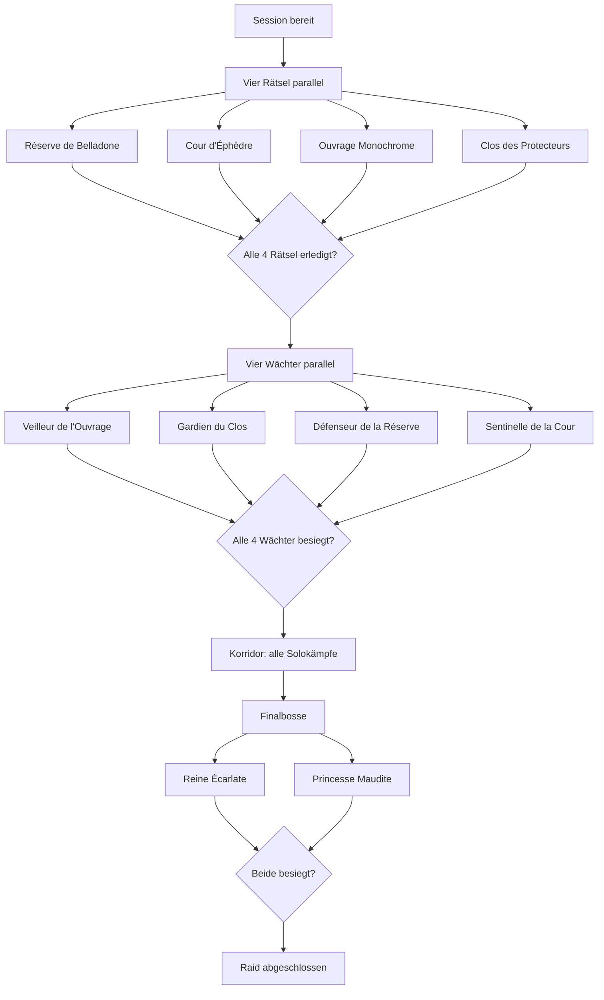

# Sanctuaire Task Graph

**Dokumentstatus:** Implementierungsgrundlage v0.2.1 / Projekt v0.8.6.1  
**Raid:** Sanctuaire des Jardins éternels  
**Spielstand:** Update 3.6 / geprüft am 26.06.2026  
**Korridor-Baseline:** `10 Räume × 6 Monster = 60`, `GUIDE_CONFIRMED`, noch nicht durch einen eigenen RAIDWEAVE-Live-Test bestätigt. Der Wert bleibt in der Definition konfigurierbar; 80 ist keine zweite Standardwahrheit.

## 1. Quellenstatus

| Kürzel | Bedeutung |
|---|---|
| `OFFICIAL_CONFIRMED` | offizielle Ankama-Information |
| `GUIDE_CONFIRMED` | aktueller Community-Guide, eigener Live-Test kann fehlen |
| `LIVE_CONFIRMED` | durch RAIDWEAVE mit Evidenz live bestätigt |
| `LIVE_REQUIRED` | vor produktiver Freigabe im Spiel testen |
| `PLAYER_CORRECTED` | berechtigt bestätigte Pilotkorrektur mit Actor, Zeit und Notiz |

`PRODUCT_RULE` kennzeichnet davon getrennt interne Orchestrierungslogik und ist kein Vertrauensstatus.

Kernquelle:

- https://www.dofuspourlesnoobs.com/sanctuaire-des-jardins-eternels.html
- https://www.dofuspourlesnoobs.com/suivi-des-enigmes-du-raid-des-jardins-eternels.html
- https://www.dofus.com/fr/mmorpg/actualites/maj/1770516-raid-not-dead/details

## 2. Globale Sessionvariablen

```yaml
raid:
  minParticipants: 8
  maxParticipants: 16
  durationSeconds: 7200
  maxScore: 50000
  initialRaidLife: 20
  raidLifeMin: 0
  raidLifeMax: 20
  status: LOBBY | LIVE | ENDED | FAILED
  currentScore: 0
  corridorTarget: CONFIG_REQUIRED
  corridorCompleted: 0
```

### Globale Regeln

- Jedes abgeschlossene Rätsel: `+2'000 Score`.
- Jedes erfolgreich abgeschlossene Rätsel: `+1 Raid-Leben`, jedoch nie über 20.
- Rätsel-Fehler: grundsätzlich `-1 Raid-Leben`.
- Verlorener Kampf: `-1 Raid-Leben pro teilnehmendem Charakter`.
- Jeder Wächter: `+5'000 Score`.
- Vollständiger Korridor: `+2'000 Score`.
- Jeder Finalboss: `+10'000 Score`.
- Raid endet bei 0 Raid-Leben, Zeitablauf, Captain-Abbruch oder Sieg über beide Finalbosse.

## 3. Gesamtgraph



## 4. Phase S0 – Lobby und Start

### S0-001 – Session initialisieren

| Feld | Wert |
|---|---|
| Zweck | Livezustand für diesen Durchgang erzeugen |
| Voraussetzungen | Raid ausgewählt; 8–16 Teilnehmer vorgesehen |
| Eingaben | Sessionname, Sprache, Captain, optionale Startzeit |
| Ergebnis | Session-ID, Teilnehmerlink, Captainlink |
| Erfolg | Sessionstatus `LOBBY` |
| Fehler | Link oder Session nicht erzeugt |
| Quellenstatus | `PRODUCT_RULE` |

### S0-010 – Teams und Verantwortungen verteilen

Empfohlene Startbereiche:

- Boote/Bataille navale;
- Schach;
- Objekte/Farbreihenfolge;
- Gärten/Statue;
- optional Manuskriptseiten.

Das System soll freie Zuordnung und Vorlagen für 8, 12 und 16 Teilnehmer ermöglichen.

### S0-020 – Startzustand bestätigen

Zu bestätigen:

- Raidtimer startet bei 2 Stunden;
- Raid-Leben wird im Spiel mit 20 angezeigt;
- Sessionteilnehmer entsprechen dem laufenden Raid;
- Captain und mindestens ein Ersatzeditor sind online.

---

# 5. Phase S1 – Vier Rätsel

Alle vier Rätselbereiche sind parallel verfügbar. Einzelne Unteraufgaben überschneiden sich räumlich und sollen deshalb auch teamübergreifend zuweisbar sein.

## S1-BEL – Réserve de Belladone / Papierboote

### S1-BEL-010 – Sechs Papierboote aufdecken

| Feld | Wert |
|---|---|
| Zone | Ouvrage Monochrome |
| Teilnehmer | 1 minimum; 2 empfohlen für Gesamtprozess |
| Voraussetzung | Raid live |
| Aufgabe | Sechs zufällig verteilte Papierboote finden und jeweils „Position aufdecken“ |
| Eingabedaten | `boatsFound: 0..6`; Finder; optional Kartenposition |
| Ergebnis | Je drei Boote erscheinen auf den zwei Schlachtfeldern |
| Warnung | Papierblumen nicht versehentlich anklicken |
| Quellenstatus | `GUIDE` |

### S1-BEL-020 – Bootspositionen erfassen

Zwei Spielfelder:

- Réserve de Belladone `[21,17]`;
- Réserve de Belladone `[19,15]`.

Zu speichern:

```yaml
boardA:
  location: "[21,17]"
  boatCells: []
boardB:
  location: "[19,15]"
  boatCells: []
```

### S1-BEL-030 – Bataille navale ausführen

| Feld | Wert |
|---|---|
| Voraussetzungen | sechs Boote aufgedeckt; beide Spielfelder besetzt |
| Ablauf | Spielfelder feuern abwechselnd; `[21,17]` beginnt |
| Ziel | alle sechs Boote versenken |
| Livezustände | aktives Spielfeld, Treffer, verbleibende Boote, letzter Schuss |
| Abschluss | Rätsel im Spiel bestätigt |
| Auswirkung | `+2'000 Score`; `+1 Raid-Leben` bis Maximum |
| Fehlerbehandlung | Guideangabe: Jeder Fehler setzt alle versenkten Boote zurück und kostet `-1 Raid-Leben`; im Pilot bestätigen |
| Quellenstatus | `GUIDE`, genaue Fehlervarianten `LIVE_REQUIRED` |

## S1-EPH – Cour d'Éphèdre / Schach

### S1-EPH-010 – Schachbretter aktivieren

- In Cour d'Éphèdre `[12,14]` mit Belladone sprechen.
- Dadurch erscheinen Figuren auf vier Brettern in der Réserve de Belladone.

### S1-EPH-020 – Vier gültige Figuren identifizieren

Gesucht werden zwingend:

- schwarzer Läufer;
- weisser Läufer;
- schwarzer Turm;
- weisser Turm.

Jede Figur anklicken:

- rot = nicht relevant;
- grün = gesuchte Figur.

Zu speichern:

```yaml
chessPieces:
  blackBishop: { board: null, coordinate: null }
  whiteBishop: { board: null, coordinate: null }
  blackRook: { board: null, coordinate: null }
  whiteRook: { board: null, coordinate: null }
```

Falsches Prüfen kostet laut Guide kein Raid-Leben.

### S1-EPH-030 – Vier Spieler für den Schachkampf bestätigen

| Regel | Wert |
|---|---|
| genaue Teilnehmerzahl | 4 |
| Startort | Belladone `[12,14]` |
| Vorbedingung | alle vier Zielkoordinaten vollständig |
| Blockade | weniger oder mehr als vier Teilnehmer |

### S1-EPH-040 – Figuren auf Zielpositionen bewegen

- Spieler werden zu zwei Türmen und zwei Läufern transformiert.
- Türme bewegen sich orthogonal.
- Läufer bewegen sich diagonal.
- Ziel ist die zuvor gespeicherte Position.
- Erfolg muss spätestens am Ende des vierten Belladone-Zuges vorliegen.

Zu tracken:

- Spieler ↔ Figur;
- Zielkoordinate;
- erreicht;
- verbleibende Runden.

Erfolg: `+2'000 Score`, `+1 Raid-Leben` bis 20.  
Niederlage: Verlust entsprechend teilnehmender Charaktere; im Produkt als Kampfniederlage protokollieren.

## S1-OUV – Ouvrage Monochrome / Objekte und Farbe

### S1-OUV-010 – Vier Podeste erfassen

Orte:

- Podest I und III: Clos `[11,21]`;
- Podest II und IV: Clos `[12,20]`.

Jedes Podest zeigt zwei Objekte. Zulässige Objektwerte:

- Crayon;
- Kamas;
- Bague;
- Règle;
- Arakne;
- Bobine;
- Bougie;
- Lanterne.

Datenmodell:

```yaml
pedestals:
  I: [null, null]
  II: [null, null]
  III: [null, null]
  IV: [null, null]
```

### S1-OUV-020 – Je Podest die richtige Papierblume bestimmen

Zugeordnete Karten im Ouvrage:

| Objekt | Position |
|---|---|
| Crayon | `[21,7]` |
| Kamas | `[22,7]` |
| Bague | `[23,7]` |
| Règle | `[21,8]` |
| Arakne | `[23,8]` |
| Bobine | `[21,9]` |
| Bougie | `[22,9]` |
| Lanterne | `[23,9]` |

Für Podest I, II, III und IV wird jeweils geprüft, auf welcher der zwei zugehörigen Objektkarten eine Papierblume steht.

Zu speichern:

```yaml
flowerSequence:
  - pedestal: I
    selectedObject: null
  - pedestal: II
    selectedObject: null
  - pedestal: III
    selectedObject: null
  - pedestal: IV
    selectedObject: null
```

### S1-OUV-030 – Blumen in Reihenfolge aktivieren

- Reihenfolge zwingend I → II → III → IV.
- Falsche Blume: `-1 Raid-Leben`.
- Richtige Blume wird bestätigt.

### S1-OUV-040 – Endfarbe erfassen

Mögliche Werte:

- `AMBRE_ORANGE`;
- `AZURE_BLEU`;
- `VIRIDINE_VERT`;
- `ECARLATE_ROUGE`.

Auswirkungen:

- Rätsel abgeschlossen;
- `+2'000 Score`;
- `+1 Raid-Leben` bis 20;
- Farbe wird automatisch an `S1-CLO-040`, `S2-SEN-020` und Mechanikhinweise der Sentinelle übertragen.

## S1-CLO – Clos des Protecteurs / Gärten und Zielmonster

### S1-CLO-010 – Vier Gartenpaare zuweisen

Für jede Richtung relativ zum Portal:

- Garten im Clos ansehen;
- korrespondierenden Miniaturgarten in Cour d'Éphèdre öffnen;
- drei fehlende Statuen erfassen.

Zustände pro Garten:

```yaml
garden:
  direction: NORTH | EAST | SOUTH | WEST
  observedStatues: []
  placedCells: []
  validated: false
  validationFailed: false
```

### S1-CLO-020 – Drei Statuen je Garten rekonstruieren

- Falscher Klick allein kostet noch kein Leben.
- Erst falsche Validierung erzeugt `-1 Raid-Leben`.
- Vier erfolgreiche Validierungen sind nötig.

### S1-CLO-030 – Schlussstatue erfassen

Nach vier validierten Gärten erscheint im Clos `[11,20]` eine Schlussstatue.

Mögliche Typen:

- Dahliane;
- Fracamélia;
- Muguégide;
- Tritulipe.

Dieses Ergebnis ist später für den Veilleur zwingend.

### S1-CLO-040 – Farbe aus Ouvrage übernehmen

Vorbedingung: `S1-OUV-040 COMPLETED`.

Kombination:

```yaml
closTarget:
  statueType: null
  monochromeColor: null
  expectedMonster: null
  expectedMap: null
```

Versionierte Zuordnung laut aktuellem Guide:

| Farbe | Dahliane | Fracamélia | Muguégide | Tritulipe |
|---|---|---|---|---|
| Ambré / Orange | Dahliane ambré `[11,21]` | Fracamélia ambré `[11,19]` | Muguégide ambré `[12,20]` | Tritulipe ambré `[10,20]` |
| Azuré / Bleu | Dahliane azuré `[11,19]` | Fracamélia azuré `[11,21]` | Muguégide azuré `[10,20]` | Tritulipe azuré `[12,20]` |
| Écarlate / Rouge | Dahliane écarlate `[10,20]` | Fracamélia écarlate `[12,20]` | Muguégide écarlate `[11,21]` | Tritulipe écarlate `[11,19]` |
| Viridine / Vert | Dahliane viridine `[12,20]` | Fracamélia viridine `[10,20]` | Muguégide viridine `[11,19]` | Tritulipe viridine `[11,21]` |

**Quellenstatus:** `GUIDE`; im Pilot mit `SAN-P0-007` bestätigen.

### S1-CLO-050 – Korrektes Zielmonster wählen und besiegen

- maximal vier Charaktere;
- falsches Monster: Kampf sofort verloren und `-1 Raid-Leben`;
- korrektes Monster: normaler Kampf;
- Ergebnis wird als Schlussresultat des Clos gespeichert.

Abschluss:

- `+2'000 Score`;
- `+1 Raid-Leben` bis 20;
- `statueType` wird an den Veilleur übertragen.

## S1-ALL-900 – Rätsel-Gate

Freischaltung, wenn:

```text
BEL completed
AND EPH completed
AND OUV completed
AND CLO completed
```

Resultat:

- alle vier Wächter werden `READY`;
- Captain erhält Teamverteilungswarnung;
- Rätselresultate werden schreibgeschützt, aber mit Captain-Override korrigierbar.

---

# 6. Phase S2 – Vier Wächter

Gemeinsame Regeln:

- maximal vier Spieler pro Wächterkampf;
- alle vier Kämpfe können parallel erfolgen;
- jeder Sieg: `+5'000 Score`;
- Niederlage: `-1 Raid-Leben pro Charakter`;
- Guardian-Karten müssen die benötigten Rätseldaten direkt anzeigen.

## S2-VEI – Veilleur de l'Ouvrage

### S2-VEI-010 – Zieltyp laden

Input: `closTarget.statueType`.

### S2-VEI-020 – Richtiges Begleitmonster zuerst besiegen

- Der Veilleur startet unverwundbar.
- Er beschwört einen Tritulipe, Muguégide, Dahliane und Fracamélia.
- Zuerst muss der Typ besiegt werden, der der Schlussstatue aus dem Clos entspricht.
- Falscher erster Kill: Kampf endet; Raid verliert Leben entsprechend Teilnehmerzahl.
- Richtiger Kill: Veilleur dauerhaft verwundbar; Schadensmodifikatoren werden aktiv.

### S2-VEI-030 – Kampf abschliessen

Status: `ACTIVE → COMPLETED | FAILED`.

## S2-GAR – Gardien du Clos

### S2-GAR-010 – Vier sichere Objekte laden

Input: die vier in `flowerSequence` ausgewählten Objekte.

### S2-GAR-020 – Richtige vier Glyphen auslösen

- acht Objektglyphen vorhanden;
- nur die vier Blumenobjekte sind sicher;
- falsche Glyphe beendet den Kampf;
- Beschwörungen können laut Guide Glyphen auslösen.

UI-Anforderung: Vier sichere Objekte gross und unverwechselbar anzeigen.

### S2-GAR-030 – Kampf abschliessen

Nach vier korrekten Glyphen wird der Gardien verwundbar.

## S2-DEF – Défenseur de la Réserve

### S2-DEF-010 – Kampf starten

- kein Rätselresultat erforderlich;
- vier Begleitmonster;
- kein Invulnerabilitätszustand.

### S2-DEF-020 – Eskalation verfolgen

Operational wichtige Mechanik:

- pro eigenem Zug `+5 % Endschaden`;
- zugleich `+5 % erlittener Schaden`;
- maximal zehn Stapel;
- nach Tod aller Begleitmonster spielt er zweimal pro Runde.

Optionaler Kampftracker:

```yaml
defender:
  passiveStacks: 0
  addsAlive: 4
  doubleTurnActive: false
```

### S2-DEF-030 – Kampf abschliessen

## S2-SEN – Sentinelle de la Cour

### S2-SEN-010 – Monochrome-Farbe laden

Input: `monochromeColor`.

Elementzuordnung:

| Farbe | Element |
|---|---|
| Ambre/Orange | Erde |
| Azur/Blau | Wasser |
| Viridine/Grün | Luft |
| Écarlate/Rot | Feuer |

### S2-SEN-020 – Korrektes Obeliskziel anzeigen

Vier Obelisken, je 5'000 HP mit Schwelle bei 1 HP.

- nur der farblich passende Obelisk darf auf 1 HP gebracht werden;
- falscher Obelisk auf 1 HP beendet den Kampf;
- richtiges Ziel erzeugt Glyphe und macht Sentinelle verwundbar, solange sie darin steht.

### S2-SEN-030 – Kampf abschliessen

## S2-ALL-900 – Wächter-Gate

Freischaltung nur, wenn alle vier Wächter `COMPLETED`.

Resultat:

- Korridor wird geöffnet;
- optionaler Hinweis auf Manuskriptseite `[16,12]`;
- Korridorziel wird aus versionierter Raiddefinition geladen.

---

# 7. Phase S3 – Korridor

## S3-COR-010 – Guide-Baseline verwenden und live verifizieren

**Guide-Baseline:** 60 aus 10 Räumen × 6 Monstern; eigener RAIDWEAVE-Live-Test offen.

V1-Regel:

```yaml
corridorTarget:
  value: 60
  sourceStatus: GUIDE_CONFIRMED
  liveConfirmedByRaidweave: false
```

Der Captain sieht Quelle und offenen Live-Status. Eine Abweichung wird zunächst über `Information incorrecte` gemeldet; nur Captain oder Editor kann sie als `PLAYER_CORRECTED` bestätigen. Eine Definitionsänderung erfolgt danach separat und versioniert.

## S3-COR-020 – Räume erzeugen

Guidebasierte Struktur:

- 10 Räume;
- 6 Solokämpfe je Raum;
- 60 total.

Jeder Kampf:

- nur solo;
- kein Begleiter;
- vollständige Heilung nach Kampf;
- bei Niederlage Raid-Lebensverlust gemäss Kampfregel.

## S3-COR-030 – Solokämpfe verteilen

Funktionen:

- Teilnehmer erhält nächsten freien Kampf;
- Captain kann Räume priorisieren;
- pro Spieler laufender Kampf;
- Gesamtzähler;
- Restzeitprognose;
- verlorene Kämpfe neu freigeben.

## S3-COR-040 – Korridor abschliessen

Wenn `corridorCompleted == corridorTarget`:

- `+2'000 Score`;
- Zugang zur Turmphase;
- beide Finalbosse `READY`.

---

# 8. Phase S4 – Finalbosse

Gemeinsame Regeln:

- jeder Bosskampf maximal acht Charaktere;
- bei 16 Spielern parallel als 8+8 möglich;
- sonst nacheinander empfohlen;
- beide Siege sind für Raidabschluss nötig.

## S4-QUE – Reine Écarlate

### S4-QUE-010 – Team und Startbereitschaft

Zu tracken:

- Teamgrösse;
- Schutz/Support optional als Hinweis;
- laufende Versuche;
- Gefängnisrollen;
- Bossphase.

### S4-QUE-020 – Phase 1 verfolgen

Operational relevante Zustände:

```yaml
queen:
  phase: 1
  damageToThreshold: 50000
  prisoners: []
  royalPunishmentTurnsRemaining: null
  escapedPlayers: []
```

Hinweise:

- `Châtiment Royal` löst nach zwei Runden globalen Mehrfachschaden aus;
- Gefangene erhöhen Schaden und können die Königin heilen;
- 50'000 Schaden lösen Schwelle aus;
- Königin heilt vollständig und wechselt zu Phase 2.

### S4-QUE-030 – Phase 2 freischalten

Bei Phase 2:

- Königin unverwundbar;
- Volonté de la Princesse: 30'000 HP;
- Königin spielt zweimal pro Runde;
- Pommeau Enraciné und Lame Fleurie erscheinen;
- beide sind zunächst eine Runde unverwundbar.

### S4-QUE-040 – Pommeau und Lame eliminieren

- Pommeau: nach Tod erhält Königin +5 % Endschaden;
- Lame: nach Tod erhält Königin +10 % Krit;
- nach Tod beider verliert sie Invulnerabilität dauerhaft.

### S4-QUE-050 – Reine besiegen

Erfolg: `+10'000 Score`, Bossstatus `COMPLETED`.

## S4-PRI – Princesse Maudite

### S4-PRI-010 – Team und Startbereitschaft

### S4-PRI-020 – Phase 1 verfolgen

```yaml
princess:
  phase: 1
  damageToThreshold: 50000
  floraison: 0
  cursedStatues: []
  flowerSide: ALLY | ENEMY
```

Hinweise:

- in Nahdistanz unverwundbar; Schaden nur aus Distanz;
- ab Runde 2 werden Charaktere in Sichtlinie zu Statuen;
- Statue muss vor nächstem Prinzessinnenzug mit Waffenangriff befreit werden;
- Floraison steigt mit Schadenszaubern;
- bei 10 folgt globale starke Attacke mit Erosion;
- 50'000 Schaden lösen Phase 2 aus; Prinzessin heilt vollständig.

### S4-PRI-030 – Phase 2 freischalten

- Prinzessin wird unverwundbar;
- Volonté de la Reine: 30'000 HP;
- Prinzessin spielt zweimal pro Runde;
- Kernmechaniken aus Phase 1 bleiben aktiv.

### S4-PRI-040 – Zwei Incantations Florales anwenden

Voraussetzung:

- Fleur maudite bleibt auf gegnerischer Seite;
- sie erzeugt pro Runde eine violette Glyphe;
- Spieler betritt Glyphe und erhält einmaligen Zauber.

Ablauf:

1. erste Incantation auf Prinzessin → Zustand markieren;
2. zweite Incantation auf Prinzessin → Invulnerabilität dauerhaft entfernen.

Empfehlungswarnung:

- Volonté de la Reine möglichst zuerst eliminieren;
- Prinzessin bleibt auch danach in Nahdistanz unverwundbar.

### S4-PRI-050 – Princesse besiegen

Erfolg: `+10'000 Score`, Bossstatus `COMPLETED`.

## S4-ALL-900 – Raidabschluss

Bedingung:

```text
Reine Écarlate COMPLETED
AND Princesse Maudite COMPLETED
```

Aktionen:

- Session beenden;
- Endscore einfrieren;
- Dauer speichern;
- Raid-Leben speichern;
- Timeline und Zusammenfassung erzeugen.

---

# 9. Optionale Nebenaufgaben

Nicht blockierend, aber als Zusatzmodul sinnvoll:

## Manuskriptseiten

| Seite | Position | Freischaltung |
|---|---|---|
| 1 | Ouvrage `[22,9]` | direkt |
| 2 | Clos `[12,20]` | direkt |
| 3 | Réserve `[19,15]` | direkt |
| 4 | Cour `[9,14]` | direkt |
| 5 | Corridor `[16,12]` | nach Wächtern |

Jede Seite muss nach Aufnahme doppelt angeklickt/gelesen werden, damit der Erfolg fortschreitet.

---

# 10. Produktwarnungen und Automationen

## Kritisch

- Raid-Leben ≤ 5;
- falsches Wächterziel noch nicht bestätigt;
- Korridorrestmenge bei geringer Restzeit;
- Finalboss ohne volles Team;
- Rätselresultat unbestätigt, obwohl abhängiger Kampf startet.

## Automatische Übertragungen

| Quelle | Ziel |
|---|---|
| Monochrome-Farbe | Clos, Sentinelle |
| Schlussstatue Clos | Zielmonster, Veilleur |
| Blumenobjekte | Gardien-Glyphen |
| Rätselabschlüsse | Wächter-Gate |
| Wächterabschlüsse | Korridor-Gate |
| Korridorabschluss | Finalboss-Gate |

## Noch live zu prüfen

1. Guide-Baseline 60 Korridormonster im aktuellen Build live bestätigen;
2. exakte Fehlerfolgen bei Bataille navale;
3. Captainwechsel und Disconnects;
4. sichtbare In-Game-Gesamtzähler;
5. Verhalten bei parallelen Bosskämpfen und Raidzeitende;
6. Hotfix-Auswirkungen nach Version 3.6.4.3.
